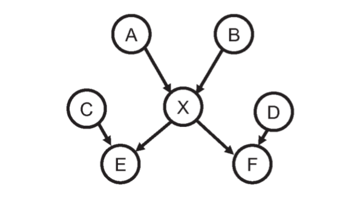

Murphy, K. "Machine Learning: A Probabilistic Approach" *Massachusetts Institute of Technology* (2012).

- current chapter: Directed Graphical Models

## Summary

This chapter begins with an interesting quotation:

>I basically know of two principles for treating complicated systems
>in simple ways: the first is the principle of modularity and the
>second is the principle of abstraction. I am an apologist for
>computational probability in machine learning because I believe that
>probability theory implements these two principles in deep and
>intriguing ways---namely through factorization and through
>averaging. Exploiting these two mechanisms as fully as possible seems
>to me to be the way forward in machine learning.
>
Michael Jordan, (Frey 1998).

Suppose we had $V$ random variables $x_{1:V}$, each taking on one out
of $K$ values. The *chain rule* states that
$$p(x_{1:V}) = p(x_1) p(x_2|x_1) \dotsm p(x_V| x_{1:V-1}).$$
We can construct *conditional probability tables* $T$:
$$T_{i_1i_2\dotsm i_{V-1} k} = p(x_k | x_{i_1},\dotsc, x_{i_{V-1}}).$$
But then, there are $O(K^V)$ parameters, needing a lot of data to
learn.

If we only care about evaluating the probability of a fully observed
vector $\mathbf{x}_{1 : T}$, then the more parsimonius *conditional
probability distribution* (CPD) suffices, $p(x_t = k| \mathbf{x}_{1:
t-1})$, using only $O(K^2V^2)$ parameters.

Other than CPDs, we can reduce the number of parameters by assuming
conditional independence. Recall the definition of conditional
independence:
$$X \perp Y | Z \Leftrightarrow p(X,Y|Z) = p(X|Z)p(Y|Z).$$
For example, for 1D sequences, the (first order) *Markov assumption*
states that $x_{t+1} \perp x_{1: t-1} | x_t,$ and so the joint
distribution,
$$p(x_{1:V}) = p(x_1) \prod_{i=1}^V p(x_t | x_{t-1}),$$
is characterized by the initial probability distribution and a *state
transition matrix* $p(x_t = j|x_{t-1} = i)$.

More generally, if we want to other types of models of conditional
independence (not necessarily a 1D sequence), there are graphical
models:

**Definition 1.** A *graphical model* (GM) is a representation of a
joint distribution as a (directed/undirected) graph. The nodes of the
graph represent random variables and the lack of an edge between two
nodes represents a CI assumption. Generally, observed variables are
shaded in. 

**Notation.** Let $G = (V,E)$ be a graph. If $s,t \in V$, then let
  $G(s,t) = \mathbf{1}[(s,t) \in E]$ indicate when the edge $(s,t)$ is
  an edge. A graph is *undirected* when $G(s,t) = 1 \Leftrightarrow
  G(t,s) = 1$ for all $s,t \in V$. The *family* of a node is the node
  and all of its parents.

### Directed Graphical Models

**Definition 2.** A *directed graphical model* (DGM) is a GM whose
  graph is a DAG. These are more commonly called *Bayesian networks*,
  *belief networks*, or *causual networks*.

*Note:* there is nothing inherently "Bayesian" about Bayesian nets,
 nor anything inherently "causal". 

Because DAGs have a topological ordering, a node $x_s$ only depends on
its parents, so DGMs satisfy the *ordered Markov property*:
$$x_s \perp \mathbf{x}_{\mathrm{predecessors}(s) \setminus
\mathrm{parents}(s)} | \mathbf{x}_{\mathrm{parents}(s)},$$
where $x_s$ is conditionally independent with its nonimmediate
predecessors. And so, in general, we have a *factorization* property
for DAGs:
$$\begin{equation} \label{F}
p(\mathbf{x}_{1:V} | G) = \prod_{t=1}^V p(x_t |
\mathbf{x}_{\mathrm{parents}(t)}).
\end{equation}$$
If the family of each node is size $O(F)$, then there are at most
$O(VK^F)$ parameters, compared to the original $O(K^V)$.

**Example 3 (Naive Bayes Classifier).** Recall that the NBC (see
  [chapter 3](./2012-MLPA-chapter-3.html#naive-bayes-classifiers))
  assumes that features are conditionally independent given the class label:
  $$p(y, \mathbf{x}) = p(y) \prod_{j=1}^D p(x_j|y).$$

**Figure 1.** A graphical model corresponding to a NBC model. 

Source: <a
href="https://mitpress.mit.edu/books/machine-learning-1">Murphy
2012</a>

   

A graphical model can capture correlation between features. For
example, if the model is a tree, then we can use a *tree-augmented
naive Bayes classifier* (TAN) model (Friedman et. al. 1997). An
example is:

**Figure 2.** A graphical model corresponding to a TAN model for $D=
4$ features. In general, the tree topology may change depending on the
value of $y$.

Source: <a
href="https://mitpress.mit.edu/books/machine-learning-1">Murphy
2012</a>

  

There are two reasons for using a tree instead of a generic graph:

1. it is easy to find the optimal tree structure using the Chow-Liu
algorithm (Section 26.3).
2. It is easy to handle missing features in a tree-structured model
(Section 20.2).

**Example 4 (Directed Gaussian graphical models).** A *Gaussian Bayes
  net* is the model where the CPDs are:
  $$p(x_t | \mathbf{x}_{\mathrm{parents}(t)}) = \mathcal{N}(x_t |
  \mu_t + \mathbf{w}_t\cdot \mathbf{x}_{\mathrm{parents}(t)},
  \sigma_t^2).$$
  This is called a *linear Gaussian* CPD. The product of these CPDs
  yields: $p(\mathbf{x}) = \mathcal{N}(\mathbf{x}| \mathbf{\mu},
  \mathbf{\Sigma}).$  Let $\mathbf{W}$ be the matrix whose rows are
  $\mathbf{w}_t^T$. Let $\mathbf{S} =
  \mathrm{diag}(\mathbf{\sigma})$. Then, we have:
  $$\begin{align*}
  (\mathbf{x} - \mathbf{\mu}) = \mathbf{W}(\mathbf{x} - \mathbf{\mu})
  + \mathbf{e},
  \end{align*}$$
  where $\mathbf{e} \sim \mathcal{N}(0, \mathbf{S})$. Because of the
  DAG assumption, $\mathbf{W}$ is lower triangular. It follows that
  $\mathbf{e} = (\mathbf{I} - \mathbf{W}) (\mathbf{x} -
  \mathbf{\mu})$. Letting $\mathbf{U} = (\mathbf{I} -
  \mathbf{W})^{-1}$, we have:
  $$\begin{align*}
  \mathbf{\mu} &= \mathbf{x} - \mathbf{U} \mathbf{e}\\
  \mathbf{\Sigma} &= \mathrm{cov}[\mathbf{x} - \mathbf{\mu}] =
  \mathrm{cov}[\mathbf{U} \mathbf{e}] = \mathbf{U} \mathbf{S}^2 \mathbf{U}^T.
  \end{align*}$$
  Thus, the regression weights correspond to a Cholesky decomposition
  of $\mathrm{\Sigma}$. 

### Inference

Graphical models let us perform *probabilistic inference*, where given
observed or visible variables $\mathbf{x}_v$, we try to compute a
posterior distribution on hidden variables $\mathbf{x}_h$. That is, we
*condition* on the observed data by *clamping* the visible variables
to their observed values:
$$p(\mathbf{x}_h| \mathbf{x}_v) = \frac{p(\mathbf{x}_h,
\mathbf{x}_v)}{p(\mathbf{x}_v|\theta)}.$$
The normalization constant $p(\mathbf{x}_v|\theta)$ is the
*likelihood of the data* or the *probability of the evidence*.

If we only care about some of the hidden variables, we partition the
hidden variables into the *query variables* $\mathbf{x}_q$ that we
hope to understand and the *nuisance variables* $\mathbf{x}_n$ that we
want to *marginalize out*. Thus,
$$p(\mathbf{x}_q | \mathbf{x}_v, \theta) = \sum_{\mathbf{x}_n}
p(\mathbf{x}_q, \mathbf{x}_n| \mathbf{x}_v, \theta).$$
Notice that if there $V$ hidden variables, each of which taking on one
of $K$ values, then there are $O(K^V)$ terms in the marginal
distribution $p(\mathbf{x}_v | \theta)$. It is possible to exploit the
factorization in GM to use $O(VK^{w+1})$ computations, where $w$ is
the *treewidth* of the graph. (See Chapter 20).

### Learning

While inference is the computation of $p(\mathbf{x}_h| \mathbf{x}_v,
\theta)$ where the parameters $\theta$ are assumed to be known,
*learning* is the estimation of parameters of the model. The MAP
estimate of the parameters give data is:
$$\hat{\theta} = \mathrm{arg\ max}_{\theta} \sum_{i=1}^N \log
p(\mathbf{x}_{i,v}|\theta) + \log p(\theta).$$
If the prior is uniform, then this is just MLE. The Bayesian
perspective sees the parameters as unknown variables, so from that
perspective, there is no difference between inference and learning.

Thus, from a Bayesian perspective, the only difference between hidden
variables and parameters is that the number of hidden variables grows
with the data, while the parameters are fixed. In order to avoid
overfitting, we must integrate out the hidden variables, while a point
estimation techniques may work for parameters.

### Plate Notation

Suppose $X_1,\dotsc, X_N$ are conditionally independent on
$\theta$. If our beliefs about $\theta$ don't depend on the order that
the $X_i$'s came, then we say that the data is *exchangeable*.  In
such a case, the *plate notation* can reduce visual clutter: we draw a
*plate* around repeated variables, and we say that the nodes within
the plate will be repeated when the model is *unrolled*. For example:

**Figure 3.**  Left: the data $X_i$ are conditionally i.i.d. given
$\theta$. Right: the same model, in plate notation. 

Source: <a
href="https://mitpress.mit.edu/books/machine-learning-1">Murphy
2012</a>

  

More complicated examples can be constructed. For example, the
following is the DGM of a naive Bayes classifiers with parameter
$\theta$. 

**Figure 4.** Left: $D$ conditionally independent variables
$X_1,\dotsc, X_D$ are generated given a $Y$. Here, there are
parameters $\theta_{c}$ for every class $c$ for $Y$. It is implied
that $\theta_{jc}$ is used to generate $x_{ij}$ iff $y_i
=c$. Otherwise, it is ignored.  

Source: <a
href="https://mitpress.mit.edu/books/machine-learning-1">Murphy
2012</a>

 

 
This is an example of *context specific independence*, since $x_{ij}
\perp \theta_{jc}$ holds iff $y_i \ne c$.

### Learning from Complete Data

If there are no hidden variables, then we say that the data is
*complete*. Then, the likelihood of the parameter $\theta$ factorizes:
$$p(D|\theta) = \prod_{i=1}^N p(\mathbf{x}_i|\theta) = \prod_{t=1}^V
p(D_t | \theta_t),$$
where $D_t$ is the data associated with the node $t$ and its
parents. That is, the likelihood *decomposes* according to its graph
structure. If the prior factorizes as well, $p(\theta) = \prod_{t=1}^V
p(\theta_t)$, then the posterior also factorizes:
$$p(\theta|D) \propto \prod_{t=1}^V p(D_t|\theta_t) p(\theta_t).$$

### Conditional Independence Properties of DGMs

Let $I(G)$ be the set of all conditional independence (CI) assumptions
that a graph makes. We say that $G$ is an *I-map* (independence map)
for a probability distribution $p$, or that $p$ is *Markov* with
respect to $G$ iff $I(G) \subset I(p)$, where $I(p)$ is the set of all
CI statments that hold for $p$.

The complete graph is an I-map for any probability distribution over
its nodes. We can also consider any *minimal I-map* for a probability
distribution $p$. Our goal now is to determine when $\mathbf{x}_A
\perp_G \mathbf{x}_B | \mathbf{x}_C$.

The following topological definition can characterize when subsets of
nodes of a graph are conditionally independent.

**Definition 5.** An undirected path $P$ is *d-separated* by a set of
  nodes $E$ (containing the evidence) iff at least one of the
  following conditions hold:

  1. $P$ contains a chain $s \to m \to t$ or $s \leftarrow m
  \leftarrow t$, where $m \ in E$
  2. $P$ contains a tent or form, $s \swarrow ^m \searrow t$, where $m
  \in E$
  3. $P$ contains a *collider* or *v-structure*, $s \searrow _m
  \swarrow t$, where $m$ is not in $E$ and neither is any descendents
  of $m$.

**Definition 6.** We say that a set of nodes $A$ is d-separated from a
  different set of nodes $B$ given a third observed set $E$ iff each
  undirected path from every node $a \in A$ to every node $b \in B$ is
  d-separated by $E$.

**Proposition 7.** Let $G$ be a DAG. Then:
$$\begin{equation}\label{G}
\mathbf{x}_A \perp_G \mathbf{x}_B |\mathbf{x}_E \Longleftrightarrow 
\textrm{$A$ is d-separated from $B$ given $E$}.
\end{equation}$$

This is the *directed global Markov property*.

**Figure 5.** Visualize our knowledge of a variable that is not
explained away by evidence as a ball moving around the nodes; we call
this the *Bayes ball*. Arrows with a line across the head indicate
when the ball is blocked. Otherwise, the ball may freely traverse the
edges. 

Source: <a
href="https://mitpress.mit.edu/books/machine-learning-1">Murphy
2012</a>

 

The three rules of the Bayes ball follows.

1. The chain structure $X \to Y \to Z$ encodes:
$$\begin{align*}
p(x,y,z) = p(x) p(y|x) p(z|y).
\end{align*}$$
Conditioning on $y$ then yields:
$$\begin{align*}
p(x,z|y) = \frac{p(x) p(y|x) p(z|y)}{p(y)} = p(x|y) p(z|y),
\end{align*}$$
and so $x \perp z |y$.
2. The tent structure $X \leftarrow Y \rightarrow Z$ encodes:
$$\begin{align*}
p(x,y,z) = p(y) p(x|y) p(z|y),
\end{align*}$$
so similarly, when we condition on $y$, we see that $x \perp z | y$. 
3. The v-structure $X \rightarrow Y \leftarrow Z$ encodes:
$$\begin{align*}
p(x,y,z) = p(x) p(y|x,z) p(z),
\end{align*}$$
where conditioning on $y$ leads to:
$$\begin{align*}
p(x,z|y) = \frac{p(x) p(z) p(y|x,z)}{p(y)},
\end{align*}$$
so $x \not\perp z|y$, even though $x$ and $z$ are marginally
independent, $p(x,z) = p(x)p(z)$. This effect is called *explaining
away*, *inter-causal reasoning* or *Berkson's paradox*. For example,
if we observe the sum of two independent coin flips, then conditioned
on this knowledge, the two flips are no longer independent. 

Furthermore, if instead of observing $Y$, we observe a descendent,
then we could learn something about $Y$. Then, $X$ and $Z$ must
compete to explain this. For example, though we not observe $Y$, if we
observe a descendant $Y'$ that always take on the same value as $Y$,
we effectively observe $Y$.

**Corollary 8.** Let $t$ be a node, and let $\mathrm{nd}(t)$ be its
  *non-descendants*. Let $\mathrm{pa}(t)$ be its parents. Then,
  $$\begin{equation}
  \label{L}
    t \perp \mathrm{nd}(t) \setminus \mathrm{pa}(t) | \mathrm{pa}(t). 
  \end{equation}$$
This is called the *directed local Markov property*.

**Corollary 9.** Let $t$ as before. Let $\mathrm{pred}(t)$ be its
predecessors. Then,
$$\begin{equation}\label{O}
  t \perp \mathrm{pred}(t) \setminus \mathrm{pa}(t) | \mathrm{pa}(t). 
\end{equation}$$
This follows because $\mathrm{pred}(t) \subset \mathrm{nd}(t)$. This
property is called the *ordered Markov property*. 

Thus, we have three Markov properties for DAGs: the directed global
Markov property G, the directed local Markov property L, and the
ordered Markov property O, Equations $\ref{G}$, $\ref{L}$, and
$\ref{O}$, respectively. 

We see that $G \implies L \implies O$. In fact, $O \implies L \implies
G$, as in (Koller and Friedman 2009). Additionally, we saw that DAGs
satisfy the factorization property F in Equation $\ref{F}$. It's clear
that $O \implies F$, and in fact, the converse $F \implies O$ is also
true (Koller and Friedman 2009). 

**Definition 10.** The *Markov blanket* of a node $t$ is the set of
  nodes that renders a node $t$ conditionally independent of all other
  nodes in the graph. 

In particular, the Markov blanket $\mathrm{mb}(t)$ is equal to the
nodes parents, children, and *coparents* (any node that are also
parents of its children). Thus, $t$'s *full conditional*
(i.e. conditioning everything except $t$) depends only on its Markov
blanket. That is, if we let $\mathbf{x}_{\hat{t}}$ denote all
variables except for $x_t$, the full conditional is:
$$\begin{align*}
p(x_t| \mathbf{x}_{\hat{t}}) &= \frac{p(x_t,
\mathbf{x}_{\hat{t}})}{p(\mathbf{x}_{\hat{t}})}\\
&\propto p\left(x_t|\mathbf{x}_{\mathrm{pa}(t)}\right) \prod_{s \in
\mathrm{ch}(t)}
p\left(x_s| \mathbf{x}_{\mathrm{pa}(s)}\right),
\end{align*}$$
since any term not involved with $x_t$ will cancel out; the only terms
left are those that contain $x_t$ in the *scope*.

For example, in the DGM below, we have:
$$\begin{equation*}
p(x_5 | \mathbf{x}_{\hat{5}}) \propto p(x_5|x_2,x_3) p(x_6 | x_3,x_5)
p(x_7| x_4,x_5,x_6).
\end{equation*}$$

**Figure 6.** An example of a directed graphical model.

Source: <a
href="https://mitpress.mit.edu/books/machine-learning-1">Murphy
2012</a>

 

### Exercises

**Problem 1.** *[Exercise 10.1]* Marginalizing a node in a
  DGM. Consider the following DAG $G$:

Source: <a
href="https://mitpress.mit.edu/books/machine-learning-1">Murphy
2012</a>

 

Assume it is a minimal I-map for $p(A,B,C,D,E,F,X)$. Now consider
marginalizing out $X$. Construct a new DAG $G'$ which is a minimal
I-map for $p(A,B,C,D,E,F)$. Specify and justify which extra edges need
to be added.

*To marginalize out $X$, we need to connect every single parent of $X$
 to every one of its children, and form an acyclic tournament
 on its children:*

*As a simple example of $p(A,B,C,D,E,F,X)$ such that the new
 collection of arrows is minimal, let the random variable $X =
 (A,B,Z)$, where $Z$ is some extra randomness independent of
 $A,B,C,D$. Furthermore, let $E = (C,X,Z)$, and $F= (D,X,Z)$. Then,
 when  we marginalize away $X$, we see that each of the new arrows
 above are necessary.*

 *On the other hand, before we marginalized away $X$, for any of the
  remaining pairs of nodes $(R,S)$ with no edge between them, we knew
  that $p(R,S) = p(R)p(S)$. Thus, even after marginalizing out $X$,
  this remains true.* 

**Problem 2.** *[Exercise 10.3]* Markov blanket for a DGM. Prove that
  the full conditional for a node $i$ in a DGM is given by:
$$\begin{align*}
p(x_t| \mathbf{x}_{\hat{t}}) &\propto
  p\left(x_t|\mathbf{x}_{\mathrm{pa}(t)}\right) \prod_{s \in
  \mathrm{ch}(t)} p\left(x_s| \mathbf{x}_{\mathrm{pa}(s)}\right).
\end{align*}$$

**Problem 3.** *[Exercise 10.9]* Moralization does not introduce new
  independence statements. Recall that the process of moralizing a DAG
  means connecting together all "unmarried" parents that share a
  common child, and then dropping all the arrows. Let $M$ be the
  moralization of a DAG $G$. Show that $\mathrm{CI}(M) \subset
  \mathrm{CI}(G)$, where CI are the set of conditional independence
  statements implied by the model. 

## Discussion

**Note 1.** In the *Conditional Independence Properties of DGMs*
  section, we said that the complete graph is an I-map for any
  probability distribution. To be rigorous, we need to make sure that
  there exists a complete DAG on a collection of $n$ nodes, for all $n
  \in \mathbb{N}$ (i.e. there exists acyclic tournaments). Indeed,
  this is easily shown by just giving a total order on the vertices. 

**Note 2.** It seems that given a graph $G$ and any probability
  distribution $p$ over its node, for any node $X$ in $G$, the
  construction described in Problem 1 will always produce a new graph
  $G'$ that is Markov over the distribution $p_{\hat{X}}$ where $X$ is
  marginalized away. We only need to worry about the Markov blanket of
  $X$. Marginalizing away $X$ won't change conditional independence
  relations between parents of $X$. All other edges between parents of
  $X$ and children of $X$, and edges within children have been added.

  Furthermore, there are probability distributions where each of the
  new edges are necessary. Any example?

**Question 3.** I don't understand the distinction between a conditional
probability table and a conditional probability distribution. Why does
the latter only use $O(K^2V^2)$ parameters?

**Question 4.** This section defines a *directed acyclic graph* as "a
directed graph with no directed cycles" and a *directed tree* as "a
DAG in which there are no directed cycles". There seems to be no
distinction?

**Question 5.** What does it mean that "there is nothing inherently
  'Bayesian' about Bayesian networks" or "nothing inherently causal"?

**Note 6.** Follow up on chapters 20, 26 on TAN models and the use of
  trees.

**Note 7.** Review the Cholesky decomposition.

### Further Reading

- Chapter 20, for how to use only $O(VK^{w+1})$ time instead of
  $O(K^V)$. 
- [[Koller and Friedman 2009](https://pdfs.semanticscholar.org/04f3/9720b9b20f8ab990228ae3fe4f473e750fe3.pdf)] *Probabilistic Graphical Models: principles and techniques*.
