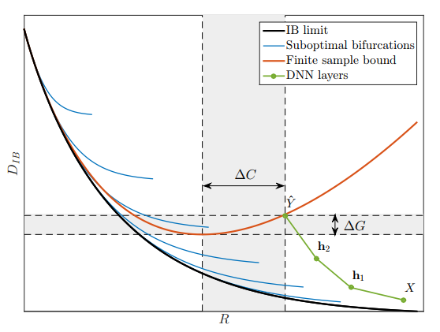
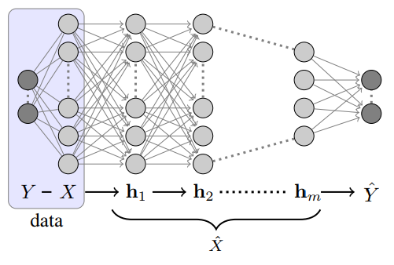

Tishby, Naftali, and Noga Zaslavsky. "Deep learning and the information bottleneck principle." Information Theory Workshop (ITW), 2015 IEEE. IEEE, 2015.

## Summary
This paper elaborates on [Tishby 2000](https://arxiv.org/pdf/physics/0004057.pdf),
expecially clarifying the *information plane* and the "structure of
solutions" (c.f. [notes](./2000-04-tishby.html#structure-of-solution)): 

In the learning problem, we want to extract the *relevant information*
about a variable $Y$ from the input source $X$ into the representation
$\hat{X}$. And so $\hat{X}$ is a *minimal sufficient statistics* of
$X$ and $Y$ (i.e. it captures as much of the mutual information
$I(X;Y)$ as possible while minimizing $I(X;\hat{X})$, other irrelvant
information). This suggests the following Lagrangian to maximize
$I(\hat{X};Y)$:
$$\mathcal{L}\big[p(\hat{x}|x)\big] = I(X;\hat{X}) - \beta I(\hat{X};Y).$$
Or, equivalently, the Lagrangian minimizing all information of $Y$ in
$X$ not captured by $\hat{X}$:
$$\tilde{\mathcal{L}} \big[p(\hat{x}|x)\big] = I(X;\hat{X}) + \beta I(X;Y|\hat{X}).$$

From Equation (2), we see that this is precisely a rate-distortion
problem, where the expected distortion is $D_{IB} =
I(X;Y|\hat{X})$. The information-theoretic limit of the tradeoff
between distortion $D_{IB}$ and rate $R$ (i.e. $I(X;\hat{X})$, the
expected bit-ratio of $\hat{X}$ and $X$) is given by the black curve on
the *information plane* below:

The tradeoff between rate $R$ of encoding $X \to \hat{X}$ and the
distortion $D_{IB}$. The black line is the information-theoretic
limit. The blue lines correspond to the limits for "different
topological representations of $\hat{X}$, such as different
cardinality in clustering by deterministic
annealing". 
Source: <a href="https://arxiv.org/pdf/1503.02406.pdf">Tishby 2015</a>
 

In the above figure, the green line corresponds to the information
$I(Y;\mathbf{h}_i)$ about $Y$ contained in the hidden layer
$\mathbf{h}_i$ in a neural network (say, the below figure). As
information cannot be recovered once lost, the curve is monotonic
increasing. 

A neural network; given input $X$, it returns an estimator $\hat{Y}$
of $Y$ through a series of hidden layers with weights $\mathbf{h}_i$. 
Source: <a href="https://arxiv.org/pdf/1503.02406.pdf">Tishby 2015</a>
 

Finally, the quantities $\Delta G$ and $\Delta C$ are the
*generalization gap* and the *complexity gap*, respectively. The
generalization gap is the amount of information the network failed to
capture while the complexity gap is the amount of unnecessary
complexity in the network.

### Asides
Consider a single neuron in a usual neural network, parametrized by weights
$\mathbf{w}$ and biases $\mathbf{b}$:
$$\mathrm{Neuron}(\mathbf{x}) = \mathrm{sigmoid}(\mathbf{w} \cdot
\mathbf{x} + \mathbf{b}).$$
Such a neuron can only classify linearly separable inputs. They are
linearly separable if the inputs are conditionally independent. See
[Richard 1991](http://www.ee.iisc.ac.in/new/people/faculty/prasantg/downloads/NeuralNetworksPosteriors_Lippmann1991.pdf) for more details.
 
Hidden layers within a neural network then allow for representational
changes, to decouple the inputs. Other techniques can also decouple
inputs---embedding into higher dimension (kernels) or random expansion.

## Discussion
**Question 1:** this paper notes that this analysis is possible
through viewing "DNN training as a successive (Markovian)"
compressions of data. Can we use this perspective to explicitly view
neural networks as dynamical systems? (c.f. question 1 in
[notes](../evolution-strategies/2017-12-zhang.html#discussion)).

**Question 2:** can this perspective be used to analyze other learning
  models? 

### Keywords/Further Reading

- [Mehta 2014](https://arxiv.org/pdf/1410.3831.pdf), An exact mapping
  between Variational Renormalization Group and Deep Learning
- [Richard 1991](http://www.ee.iisc.ac.in/new/people/faculty/prasantg/downloads/NeuralNetworksPosteriors_Lippmann1991.pdf),
  Neural network classifiers estimate Bayesian *a posteriori* 
  probabilities
- On dynamical systems and neural networks, perhaps [Haschke 2004](http://www.sciencedirect.com/science/article/pii/S0925231204005120)
  may be useful.