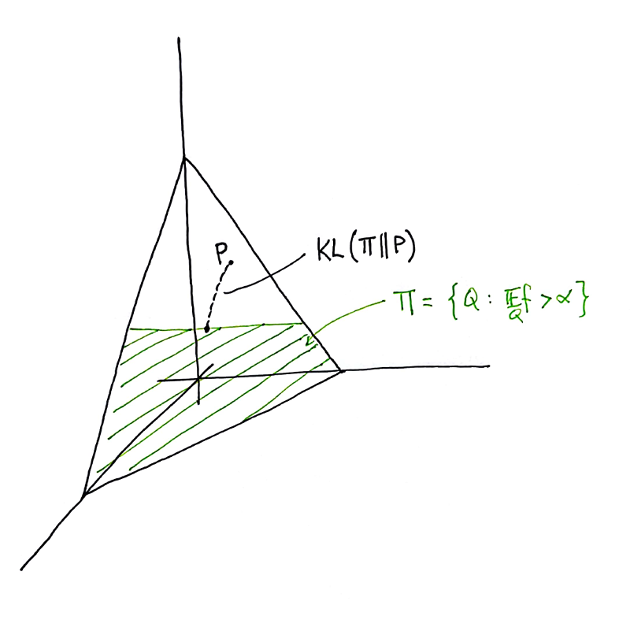

Csiszár, I, and Shields, P.C. [Information Theory and Statistics: A Tutorial](https://users.renyi.hu/~csiszar/Publications/Information_Theory_and_Statistics:_A_Tutorial.pdf)

- [prev chapter](./2004-csiszar-info-theory-1.html): Preliminaries
- [this chapter](#): Large deviations, hypothesis testing
- [next chapter](#): I-projections

## Summary

In the following, we can study large deviations combinatorially. We
consider the space of all possible finite samples, their sizes, and
relationship with entropy and KL-divergence. 

### Large deviations via types

Let $A$ be a finite alphabet of size $t$.

- the **type** of a sequence $x_1^n \in A^n$ is its empirical
distribution $P$, 
$$\begin{equation*}
P(a) = \frac{\# \{i : x_i = a\}}{n}
\end{equation*}$$
- the **type class of the $n$-type $P$**, $T_P^n$, is the collection
of all sequences of type $P$. 
- a distribution $P$ is an $n$-**type** if it is the empirical
distribution of some $x_1^n \in A^n$. 
- let $\mathcal{P}_n$ be the collection of all $n$-types.

We can list a few facts about this set of objects:

- by the stars-and-bars theorem, the number of $n$-types is
$$\begin{equation*}
|\mathcal{P}_n| = \binom{n + t - 1}{t - 1}.
\end{equation*}$$
- let $P$ be an $n$-type, $k_i = n\cdot p_i$ be the number each letter 
$i$ appears. The size of $T_P^n$ is 
$$\begin{equation*}
\left|T_P^n\right| = \frac{n!}{k_1! \dotsm k_t!}.
\end{equation*}$$
- let $P \in \mathcal{P}_n$. Denote by  $k_i = n \cdot p_i$ be  the
expected number of times that each letter is seen. Suppose we draw
$x_1^n$ from the distribution $P^n$. Let's say that $x_1^n$ has type
$Q$, where $Q \in \mathcal{P}_n$ amd each letter $i$ appears $j_i$
times in $x_1^n$. The probability of seeing $x_1^n$ is:
$$\begin{equation*}
P^n(x_1^n) = \frac{1}{n^n} \cdot  k_1^{j_1} \dotsm k_t^{j_t}.
\end{equation*}$$
If $Q = P$, then the probability of observing $x_1^n$ is: 
$$\begin{equation} \label{entropy}
P^n(x_1^n) = p_1^{k_1} \dotsm p_t^{k_t} = p_1^{n p_1} \dotsm p_t^{n
p_t} = 2^{-n \cdot H(P)}. 
\end{equation}$$
In general, the probability that a sample drawn from $P^n$ has type
$Q$ is: 
$$\begin{equation*}
P^n(T_Q^n) = \frac{1}{n^n} \cdot\frac{n!}{j_1! \dotsm j_t!}k_1^{j_1}
\dotsm k_t^{j_t}. 
\end{equation*}$$
The following lemma shows that $P(T_Q^n)$ is maximized when $Q = P$:

**Lemma 1.** *Let $j_1,\dotsc, j_t$ be nonnegative integers with sum
$j_1 + \dotsm + j_t = n$. The following is maximized when $j_i = k_i$
for all $1 \leq i \leq t$* 
$$\begin{equation*}
\frac{n!}{j_1! \dotsm j_t!} k_1^{j_1} \dotsm k_t^{j_t}.
\end{equation*}$$

*Proof.* If $j_r > k_r$ and $j_s < k_s$, then we can increase the
overall value by decreasing $j_r$ by 1 and increasing $j_s$ by 1. This
amounts to multiplying by: 
$$\begin{equation*}
\frac{j_r}{k_r} \frac{k_{s+1}}{j_s + 1} \geq \frac{j_r}{k_r} > 1.
\end{equation*}$$

☐

This lets us relate $|T_P^n|$ to the entropy $H(P)$, through the
equation: $\sum_{Q \in \mathcal{P}_n} P^n(T_Q^n) = 1$ along with the
previous lemma which shows that the largest term in the sum is:
$$\begin{equation*}
P^n(T_P^n) = |T_P^n| \cdot 2^{- n \cdot H(P)}.
\end{equation*}$$
Because there are $\binom{n + t - 1}{t - 1}$ terms in the sum, we
obtain: 

**Lemma 2.** *For any $n$-type $P$,*
$$\begin{equation*}
\binom{n + t - 1}{t - 1}^{-1} 2^{n\cdot H(P)} \leq \left|T_P^n\right|
\leq 2^{n\cdot H(P)}. 
\end{equation*}$$

Equation $\ref{entropy}$ related entropy to the probability of seeing
a sequence $x_1^n$ of type $P$ when drawn from $P^n$. Now, suppose
that $P$ is any distribution, and we again draw a sequence $x_1^n$ of
type $Q$. Let's compare the probabilities that $x_1^n$ was drawn from
$P^n$ versus $Q^n$:
$$\begin{equation}\label{kl-div}
\frac{P^n(x_1^n)}{Q^n(x_1^n)} = \prod_{i=1}^t \frac{p_i^{n \cdot
q_i}}{q_i^{n \cdot q_i}} = 2^{- n \cdot \mathrm{KL}(Q||P)}.
\end{equation}$$
It quickly follows that:

**Lemma 3.** *For any distribution $P$, $n$-type $Q$, and any $x_1^n
  \in T_Q^n$,*
$$\begin{equation*}
\binom{n + t - 1}{t - 1}^{-1} 2^{-n \cdot \mathrm{KL}(Q||P)} \leq
  P^n(T_Q^n) \leq 2^{-n \cdot \mathrm{KL}(Q||P)}.
\end{equation*}$$

This upper bound lets us show that the empirical distribution
converges to $P$ in KL divergence as $n$ goes to infinity:

**Corollary 4.** *Let $\hat{P}_n$ denote the empirical distribution of
  a random sample of size $n$ drawn from $P$. Then for all $\delta > 0$:*
$$\begin{equation*}
\mathrm{Pr}\big[\mathrm{KL}(\hat{P}_n || P) \geq \delta\big] \leq
  \binom{n + t - 1}{t - 1} 2^{-n \delta}
\end{equation*}$$

*Proof.* The probability that the empirical distribution $\hat{P}_n$
 is at least $\delta$ away from $P$ in KL-divergence is:
 $$\begin{equation*}
 \mathrm{Pr}\big[\mathrm{KL}(\hat{P}_n || P) \geq \delta\big] =
 \sum_{\substack{Q \in \mathcal{P}_n \\ \mathrm{KL}(Q||P) \geq
 \delta}} P^n(T_Q^n)  \leq |\mathcal{P}_n|\cdot  2^{-n \delta}.
 \end{equation*}$$
Note that $|\mathcal{P}_n| \cdot 2^{-n \delta} = O\left(2^{-n \delta +
 t \log n} \right)$.

☐

This corollary combined with the Borel-Cantelli lemma implies that
$\hat{P}_n$ converges to $P$ with probability 1 as $n \to \infty$, a
fact we also know from the law of large numbers.

The following theorem is a special case of Sanov's theorem over a
finite space. It shows that if $\Pi$ is a collection of distributions
bounded away from $P$ in KL-divergence, then the probability that
$\hat{P}_n$ is contained in $\Pi$ is exponentially small. To state
this formally, we define:
$$\mathrm{KL}(\Pi || P) := \inf_{Q \in \Pi} \mathrm{KL}(Q || P).$$

**Theorem 5 (Sanov's theorem).** *Let $\Pi$ be a set of distributions
  such that its closure is equal to the closure of its interior:
  $\mathrm{cl}(\Pi) = \mathrm{cl}(\mathrm{int}(\Pi))$. Let $\hat{P}_n$ be the empirical
  distribution of a random sample from $P^n$. Then:*
  $$\begin{equation*}
  - \frac{1}{n} \log \mathrm{Pr}\big[\hat{P}_n \in
  \mathrm{cl}(\Pi)\big] \to \mathrm{KL}(\Pi||P).
  \end{equation*}$$

*Proof.* Notice that the set $\bigcup \mathcal{P}_n$ is dense in the
 probability simplex $\Delta^{t-1}$ (aside: each of the
 $\mathcal{P}_n$ is a lattice on the simplex). Let $\Pi_n =
 \mathrm{cl}(\Pi) \cap \mathcal{P}_n$. Then, we have:
 $$\begin{equation*}
 \mathrm{Pr}\big[\hat{P}_n \in \Pi_n\big] = P^n\left(\bigcup_{Q \in
 \Pi_n} T_Q^n\right) = \sum_{Q \in \Pi_n} P^n(T_Q^n).
 \end{equation*}$$
 Lemma 3 implies:
 $$\begin{equation*}
 \binom{n + t - 1}{t - 1}^{-1} 2^{-n \cdot \mathrm{KL}(\Pi_n || P)}
 \leq  \mathrm{Pr}\big[\hat{P}_n \in \Pi_n\big] \leq \binom{n + t -
 1}{t - 1} 2^{-n \cdot \mathrm{KL}(\Pi_n || P)}.
 \end{equation*}$$
 Taking logs and multiplying through by $- \frac{1}{n}$, we obtain:
 $$\begin{equation*}
 \mathrm{KL}(\Pi_n||P) - \frac{t}{n} \log n \leq - \frac{1}{n}
 \mathrm{Pr}\big[\hat{P}_n \in \Pi_n\big] \leq
 \mathrm{KL}(\Pi_n ||P) + \frac{t}{n} \log n.
 \end{equation*}$$
 As $\mathrm{KL}(Q||P)$ is continuous in $Q$, this shows that
 $\mathrm{KL}(\Pi_n || P)$ becomes arbitrarily close to
 $\mathrm{KL}(\Pi||P)$ as $n$ goes to infinity.

☐

Sanov's theorem lets us obtain large-deviation bounds. For example,
consider the collection $\mathcal{F}$ of functions $f : A \to
\mathbb{R}$. Let $P$ be any probability distribution. Then, the map
$\mathbb{E}_P$ is dual to $f \in \mathcal{F}$, where:
$$\begin{equation*}
\mathbb{E}_P f := \sum_{i \in A} p_i \cdot f(i).
\end{equation*}$$
The collection $\Pi$ of all probability distributions $Q$ such that
$\mathbb{E}_Q f > \alpha$ corresponds to the intersection of the
probability simplex and a halfspace. The probability that the
empirical estimate $\mathbb{E}_{\hat{P}_n} f \geq \alpha$ goes
exponentially quickly to zero:
$$\begin{equation*}
 \mathrm{Pr}\big[\mathbb{E}_{\hat{P}_n} f \geq \alpha
\big] \to 2^{-n\cdot \mathrm{KL}(\Pi||P)},
\end{equation*}$$
if $\Pi$ is bounded away from $P$ in KL-divergence.

**Figure 1.** $P$ is a probability distribution on the probability
simplex. The function $f$ splits the simplex into two pieces; the
green section correspond to those $Q$ such that $\mathbb{E}_Q f >
\alpha$. The path extending out from $P$ is an exponential family of
distributions $P_t$ meeting $\mathrm{cl}(\Pi)$ at $Q^*$, defined
below. 

 

In this example, consider the exponential family of distributions,
parametrized by $t$:
$$\begin{equation*}
P_t(a) = \frac{1}{Z_t} P(a) \cdot 2^{t f(a)},
\end{equation*}$$
where $Z_t$ is a normalization factor. Then, $P_0 = P$ and also:
$$\begin{equation*}
\lim_{t \to \infty} \mathbb{E}_{P_t} f = \max_a f(a).
\end{equation*}$$
It follows by continuity over $t$ that if $\mathbb{E}_Pf < \alpha$ but
$\max_a f(a) > \alpha$, there must exist some $t^*$ such that
when $Q^* = P_{t^*}$, then $\mathbb{E}_{Q^*} f = \alpha$.

## Discussion

0. A central object we should understand is the following polynomial:
$$(X_1 + \dotsm + X_t)^n = \sum \frac{n!}{j_1! \dotsm j_t!} X_1^{j_1} \dotsm X_t^{j_t}.$$
1. We wish to study a probability distribution $P \in \Delta^{t-1}$ over a space $A$. To do this, we consider finite i.i.d. draws from $A$. Because of the i.i.d. assumption, we can consider the symmetric tensor product:
$$\begin{equation*}
(X_1 + \dotsm + X_t)^{\odot n} = \sum \frac{n!}{j_1! \dotsm j_t!} X_1^{\odot j_1} \odot \dotsm \odot X_t^{\odot j_t}.
\end{equation*}$$
This reduces the space we need to consider from the size $t^n$ to $\binom{n + t - 1}{t - 1}$. In particular, we can take this space as a lattice $\mathcal{P}_n$ on the probability simplex. And because $\bigcup \mathcal{P}_n$ is dense in $\Delta^{t-1}$, $\mathrm{KL}(Q||P)$ is continuous in $Q$, and
$$\begin{equation*}
\frac{P^n(x_1^n)}{Q^n(x_1^n)} = 2^{-n \mathrm{KL}(Q||P)}
\end{equation*}$$
for any $Q$ an $n$-type and $x_1^n \in T_Q^n$, we are ensured that as $n$ grows to infinity, $Q$ becomes a good approximation to $P$, and we can study $Q$ from a sequence $x_1^n$. Performing the same sort of reductions seems much more difficult when we lose the i.i.d. assumption. Is it still sensible to look at $\bigcup \mathcal{P}_n \subset \Delta^{t-1}$?