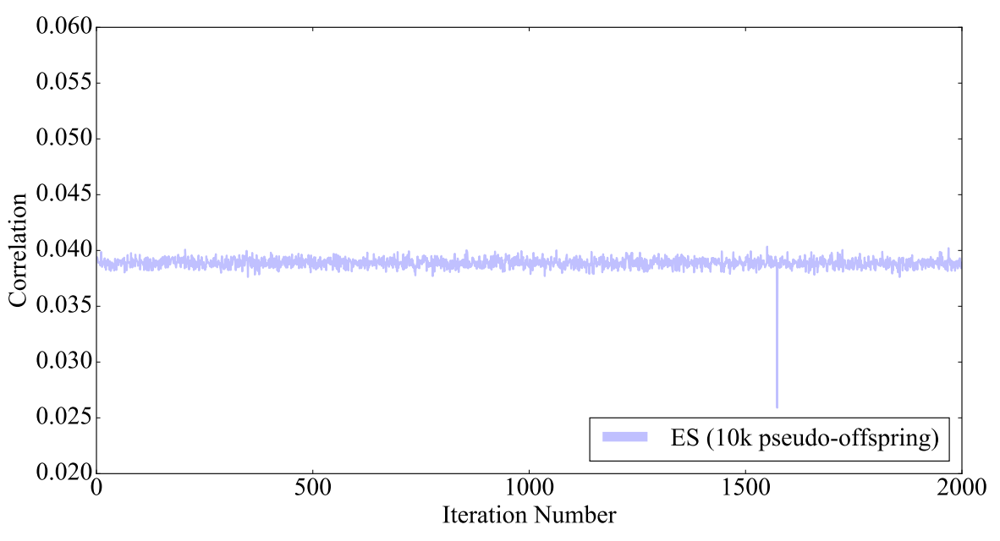
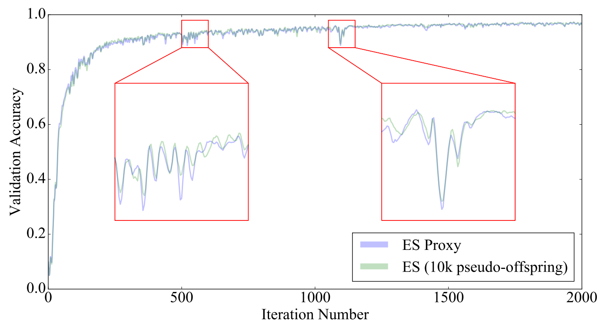

Zhang, Xingwen, Jeff Clune, and Kenneth O. Stanley. "On the Relationship Between the OpenAI Evolution Strategy and Stochastic Gradient Descent." arXiv preprint arXiv:1712.06564 (2017).

## Summary

ES as in [Salimans 2017](https://arxiv.org/pdf/1703.03864.pdf)
estimates the gradient:
$$g^{ES} = \nabla_\theta \mathbb{E}_{\epsilon \sim \mathcal{N}(0,I)}
F(\theta + \sigma \epsilon).$$
Note that this gradient is estimated by sampling $N$
"pseudo-offsprings" according to the distribution
$\mathcal{N}(\theta,\sigma^2I)$. This paper seeks to determine the
relationship between $g^{ES}$ and the 'true' gradient $g =
\nabla_\theta F(\theta)$. Theoretically, as $\sigma \to 0$ and $N \to
\infty$, then $g^{ES} \to g$. 

**Empirical results on MNIST data:**

- the average correlation between $g^{ES}$ and $g$ is 39.04%, where
  correlation is calculated at each time step $t$ in the ES algorithm
  (?? is this a typo---the paper also seems to suggest 3.9% later
  on??)
- oddly, the correlation between $g^{ES}$ and $g$ is very stable;
  small variance. Note that this is run with a relatively small value
  of $\sigma = 0.002$:
  
- running ES and SGD on the same architecture/hyperparameters led to
  96.99% and 98.69% validation accuracy, respectively.
- $g^{ES}$ may be approximated, at least at the $\sigma = 0.002$ level
  by the estimator:
  $$g^{\mathrm{Proxy}} = g + m g^{\mathrm{Noise}},$$
  where $g^{\mathrm{Noise}}$ is an independent noise vector and $m$ is
  set so that the correlation between $g^{\mathrm{Proxy}}$ and $g$ is
  equal to the correlation between $g^{ES}$ and $g$:
  

### Additional Comments

- This paper takes the perspective that the gradient computed for SGD
  is the "optimal gradient", surprised that even a low correlation
  (3.9%) to this optimal gradient can lead to validation accuracy
  within 1.70%.
- It remarks that ES is not appropriate for supervised learning, where
  "the optimal gradient...is perfectly accessible" and the additional
  overhead in ES is "clearly unwarranted". However, its advantage is
  its parallelizability.

## Discussion

Two of the most interesting aspects to this paper are (1) the
correlation between $g^{ES}$ and $g$ has very low variance; it looks
like standard deviation of < 0.1%, and (2) the validation accuracy of
ES and ES-proxy are almost identical. Why should this be the case?

Perhaps this suggests that there is a subcollection of more sensitive
parameters where even letting $\sigma = 0.002$ is too high
variance. Would this correspond to different layers of the network
(probably the earlier layers)?

**Question 1:** After training a neural network, compute the
  sensitivity of each layer of the network. Can we characterize the
  effects of the subsequent layer as 'damping' or 'amplifying'? In the
  sense that if layer $i$ is highly sensitive, then the subsequent
  layers must amplify the output of layer $i$ (so layer $i$ better be
  relatively precise). C.f. hyperbolic dynamical systems, expanding
  and contracting maps. Relation to partial derivatives?

**Question 2:** Perhaps ES-proxy makes a good proxy for ES only for
  certain values of $\sigma$. At what point might the correspondence
  break down?