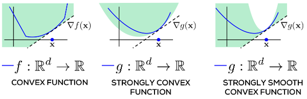
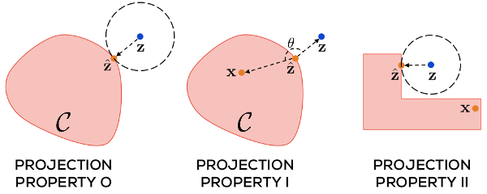

Prateek Jain & Purushottam Kar, [Non-convex Optimization for Machine Learning](https://arxiv.org/pdf/1712.07897.pdf)

- [previous chapter](./2017-nonconvex-chapter-1.html): Introduction
- current chapter: Mathematical Tools

## Summary

**Definition 1.** A *convex combination* of a set of $n$ vectors
$\mathbf{x}_i \in \mathbb{R}^p$ is a vector
$\mathbf{x}_{\mathbf{\theta}}$:
$$\begin{equation*}
\mathbf{x}_{\mathbf{\theta}} = \sum_{i=1}^n \theta_i \mathbf{x}_i,
\end{equation*}$$
where $\theta_i \geq 0$ and $\sum \theta_i = 1$.

**Definition 2.** A set $\mathcal{C} \subset \mathbb{R}^p$ is *convex*
  if for all $\mathbf{x},\mathbf{y} \in \mathbb{R}^p$ and $\lambda \in
  [0,1]$, the point $(1 - \lambda) \mathbf{x} + \lambda \mathbf{y}$ is
  contained in $\mathcal{C}$.

**Definition 3.** A continuously differentiable function $f :
  \mathbb{R}^p \to \mathbb{R}$ is *convex* if for every
  $\mathbf{x},\mathbf{y} \in \mathbb{R}^p$, we have:
  $$\begin{align*}
  f(\mathbf{y}) \geq f(\mathbf{x}) + \langle \nabla f(\mathbf{x}),
  \mathbf{y} - \mathbf{x}\rangle.
  \end{align*}$$

*Note:* we can extend convexity to nondifferentiable functions using
 subgradients.

**Definition 4.** A continuously differentiable function $f:
  \mathbb{R}^p \to \mathbb{R}$ is $\alpha$-*strongly convex* (SC) and
  $\beta$-*strongly smooth* (SS) if for every $\mathbf{x},\mathbf{y}
  \in \mathbb{R}^p$, we have
  $$\begin{equation*}
  \frac{\alpha}{2} ||\mathbf{x} - \mathbf{y}||^2_2 \leq f(\mathbf{y})
  - f(\mathbf{x}) - \langle \nabla f(\mathbf{x}), \mathbf{y} -
  \mathbf{x}\rangle \leq \frac{\beta}{2} ||\mathbf{x} - \mathbf{y}||_2^2.
  \end{equation*}$$

"A convex function is lower bounded by its own tangent at all
points. Strongly convex and smooth functions are, repsectively, lower
and upper bounded in the rate at which they may grow...In each figure,
the shaded area describes regions the function curve is permitted to
pass through."
Source: <a href="https://arxiv.org/pdf/1712.07897.pdf">Jain Kar 2017</a>
 

Both strong convexity and strong smoothness bound the rate at which a
function grows; this is useful when bounding rate of convergence of
optimization algorithms.

**Definition 5.** A function $f: \mathbb{R}^p \to \mathbb{R}$ is
  $L$-Lipschitz if for every $\mathbf{x},\mathbf{y} \in \mathbb{R}^p$,
  we have:
  $$\begin{align*}
    |f(\mathbf{x}) - f(\mathbf{y})| \leq L ||\mathbf{x} - \mathbf{y}||_2.
  \end{align*}$$

Thus, Lipschitzness upper bounds the growth linearly, while
strong-smoothness upper bounds growth quadratically. However,
Lipschitz makes no assumption about differentiability.

**Lemma 6 (Jensen's Inequality).** If $X$ is a random variable taking
  valules in a domain of a convex function $f$, then $\mathbb{E}[f(X)]
  \geq f(\mathbb{E}[X])$.

### Convex Projections

Given any closed set $\mathcal{C} \subset \mathbb{R}^p$, the
projection operator $\Pi_\mathcal{C}(\cdot)$ is defined as:
$$\Pi_\mathcal{C}(\mathbf{z}) := \mathrm{arg\ min}_{\mathbf{x} \in
\mathcal{C}} ||\mathbf{x} - \mathbf{z}||_2.$$

If $\mathcal{C}$ is convex, then this problem is a convex optimization
problem. Sometimes, there are closed-form solutions. When $\mathcal{C}
= \mathcal{B}_1(1)$, then projection is the *soft thresholding*
operation:
$$\begin{equation*}
\left(\Pi_\mathcal{C}\mathbf{z}\right)_i = \max \{\mathbf{z}_i -
\theta, 0\}, 
\end{equation*}$$
where $\theta$ is a threshold that can be determined by a sorting
operation on $\mathbf{z}$.

**Lemma 7 (Projection Property-O).** For any set $\mathcal{C} \subset
  \mathbb{R}^p$ and $\mathbf{z} \in \mathbb{R}^p$, let
  $\hat{\mathbf{z}} = \Pi_\mathcal{C}(\mathbf{z})$. Then, for all
  $\mathbf{x} \in \mathcal{C}$, $||\hat{\mathbf{z}} - \mathbf{z}||_2
  \leq ||\mathbf{x} - \mathbf{z}||_2$. 

**Lemma 8 (Projection Property-I).** For any convex set $\mathcal{C}
\subset \mathbb{R}^p$ and let $\mathbf{z}, \hat{\mathbf{z}}$ as
before. Then, for all $\mathbf{x} \in \mathcal{C}$, $\langle
\mathbf{x} - \hat{\mathbf{z}}, \mathbf{z} - \hat{\mathbf{z}}\rangle
\leq 0$.

**Lemma 9 (Projection Property-II).** Let $\mathcal{C}$, $\mathbf{z}$,
  and $\hat{\mathbf{z}}$ as in the previous lemma. Then, for all
  $\mathbf{x} \in \mathcal{C}$, $||\hat{\mathbf{z}} - \mathbf{x}||_2
  \leq ||\mathbf{z} - \mathbf{x}||_2$.

"The projection operator properties. Projection property II may be
violated by nonconvex sets. Projecting onto them may take the
projected point $\mathbf{z}$ closer to certain points in the set (for
example $\hat{\mathbf{z}}$) but farther from others (for example, $\mathbf{x}$)."
Source: <a href="https://arxiv.org/pdf/1712.07897.pdf">Jain Kar 2017</a>
 

*Proof of Lemma 7.* This follows because $\Pi_\mathcal{C}(\mathbf{z})$
solves the above optimization problem.

☐

*Proof of Lemma 8.* 

## Exercises
**Problem 1.** *[Exercise 2.1]* Show that strong smoothness does not
  imply convexity by constructing a nonconvex function $\mathbb{R}^p
  \to \mathbb{R}$ that is 1-SS.

**Problem 2.** *[Exercise 2.2]* Show that if a differentiable function
  $f$ has bounded gradient for all $\mathbf{x} \in \mathbb{R}^d$, the
  $f$ is Lipschitz. What is its Lipschitz constant?

**Problem 3.** *[Exercise 2.3]* Show that for any point $\mathbf{z}
  \in \mathcal{B}_2(r)$, the projection onto the ball is given by
  $\Pi_{\mathcal{B}_2(r)}(\mathbf{z}) = \frac{r}{||\mathbf{z}||_2}
  \cdot \mathbf{z}$.  

## Discussion

### Further Reading