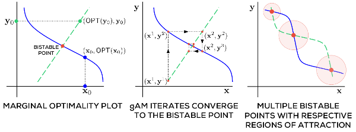

Prateek Jain & Purushottam Kar, [Non-convex Optimization for Machine Learning](https://arxiv.org/pdf/1712.07897.pdf)

- [previous chapter](./2017-nonconvex-chapter-2.html): Nonconvex Projected Gradient Descent
- current chapter: Alternating Minimization
- [next chapter](./2017-nonconvex-chapter-5.html): The EM Algorithm

## Summary

**Definition 1.** A continuously differentiable function in two
  variables $f: \mathbb{R}^p \times \mathbb{R}^q \to \mathbb{R}$ is
  *jointly convex* if for every $(\mathbf{x}^1, \mathbf{y}^1)$ and
  $(\mathbf{x}^2,\mathbf{y}^2)$, we have:
  $$f(\mathbf{x}^2, \mathbf{y}^2) \geq f(\mathbf{x}^1,\mathbf{y}^1) +
  \left\langle \nabla f(\mathbf{x}^1, \mathbf{y}^1),
  (\mathbf{x}^2,\mathbf{y}^2 ) - (\mathbf{x}^1,\mathbf{y}^1)
  \right\rangle,$$
  where $\nabla f(\mathbf{x}^1,\mathbf{y}^1)$ is the gradient at
  $(\mathbf{x}^1,\mathbf{y}^1)$.

**Definition 2.** A continuously differentiable function of two
  variables $f: \mathbb{R}^p \times \mathbb{R}^q \to \mathbb{R}$ is
  *marginally convex* in its first variable if for every $\mathbf{y}
  \in \mathbb{R}^q$, the function $f(\cdot, \mathbf{y}) :\mathbb{R}^p
  \to \mathbb{R}$ is convex. That is, for every $\mathbf{x}^1,
  \mathbf{x}^2 \in \mathbb{R}^p$, we have:
  $$f(\mathbf{x}^2, \mathbf{y}) \geq f(\mathbf{x}^1, \mathbf{y}) + 
  \left\langle \nabla_\mathbf{x} f(\mathbf{x}^1, \mathbf{y}),
  \mathbf{x}^2 - \mathbf{x}^1\right\rangle,$$
  where $\nabla_\mathbf{x}f(\mathbf{x}^1, \mathbf{y})$ is the partial
  gradient of $f$. Marginal convexity in the second variable is the
  obvious analogous condition.

**Example 3.** The function $f(x,y)$ is marginally linear, so
  marginally convex. But it is not jointly convex.

**Definition 4.** A continuously differentiable function $f:
  \mathbb{R}^p \times \mathbb{R}^q \to \mathbb{R}$ is (uniformly)
  $\alpha$-*marginally strongly convex* (MSC) and (uniformly)
  $\beta$-*marginally strongly smooth* (MSS) in its first variable if
  for every value of $\mathbf{y} \in \mathbb{R}^q$, the function
  $f(\cdot, \mathbf{y}) : \mathbb{R}^p \to \mathbb{R}$ is
  $\alpha$-strongly convex and $\beta$-strongly smooth.

*Note*: "uniform" refers to the independence of the parameters
 $\alpha$ and $\beta$ with respect to $\mathbf{y}$.

*Alternating minimization* is a technique to solve an optimization
 problem on two variables by iteratively solving the marginal
 optimization problem in each variable:

+------------------+--+----------------------------------------------------------------------------------+
| Algorithm 1      |  | gAM (Generalized Alternating Minimization)                                       |           
+=================:+==+:=================================================================================+
|            Input |  | Objective function $f: \mathcal{X} \times \mathcal{Y} \to \mathbb{R}$            |
+------------------+--+----------------------------------------------------------------------------------+
|           Output |  | A point $(\hat{\mathbf{x}}, \hat{\mathbf{y}}) \in \mathcal{X} \times \mathcal{Y}$|
|                  |  | with near optimal objective value                                                |
+------------------+--+----------------------------------------------------------------------------------+
|                1 |  | $(\mathbf{x}^1,\mathbf{y}^1) \leftarrow \mathsf{INITIALIZE}()$                   |
+------------------+--+----------------------------------------------------------------------------------+
|                2 |  | **for** $t = 1, 2, \dotsc, T$ **do**                                             |
+------------------+--+----------------------------------------------------------------------------------+
|                3 |  | $\quad \mathbf{x}^{t+1} \leftarrow \mathrm{arg\ min}_{\mathbf{x} \in \mathcal{X}}|
|                  |  | f(\mathbf{x},\mathbf{y}^t)$                                                      |
+------------------+--+----------------------------------------------------------------------------------+
|                4 |  | $\quad \mathbf{y}^{t+1} \leftarrow \mathrm{arg\ min}_{\mathbf{y} \in \mathcal{Y}}|
|                  |  | f(\mathbf{x}^{t+1},\mathbf{y})$                                                  |
+------------------+--+----------------------------------------------------------------------------------+
|                5 |  | **end for**                                                                      |
+------------------+--+----------------------------------------------------------------------------------+
|                6 |  | **return** $(\mathbf{x}^{T},\mathbf{y}^T)$                                       |
+------------------+--+----------------------------------------------------------------------------------+

We can also perform "descent" versions of gAM, where at each
iteration, the complete marginal optimization is not performed;
instead, a gradient step is taken.

A similar technique to gAM called *coordinate minimization* (CM) (and
respectively *coordinate descent* (CD), for the descent version) is
used when the objective function is convex: this procedure treats a
$p$-dimensional vector as $p$ one-dimensional variables and runs gAM
on each othe coordinates. 

**Definition 5.** Let $f$ be a function of two variables constrained
  to be in the set $\mathcal{X}$ and $\mathcal{Y}$, respectively. For
  any point $\mathbf{y} \in \mathcal{Y}$, we say that
  $\tilde{\mathbf{x}}$ is a *marginally optimal coordinate* with
  respect to $\mathbf{y}$, and use the shorthand $\tilde{\mathbf{x}}
  \in \mathsf{mOPT}_f(\mathbf{y})$ if $f(\tilde{\mathbf{x}},
  \mathbf{y}) \leq f(\mathbf{x},\mathbf{y})$ for all $\mathbf{x} \in
  \mathcal{X}$.

**Definition 6.** Let $f$ as before. Then, a point
  $(\mathbf{x},\mathbf{y})$ is considered a *bistable point* if both
  $\mathbf{x}$ and $\mathbf{y}$ are marginally optimum with respect to
  each other.

*Left*: the marginally optimal coordinate curves for $\mathbf{x}$
(solid blue line) and $\mathbf{y}$ (dashed green line). Their
intersection is a bistable curve. *Center*: the trajectory of each
iteration of the gAM algorithm. *Right*: An example of an objective
function with more than one bistable point.
Source: <a href="https://arxiv.org/pdf/1712.07897.pdf">Jain Kar 2017</a>
 

Two interesting questions are:

- how fast does gAM converge to a bistable point?
- are there (global) optimality guarantees to the bistable point gAM
converges to?

### Convergence Guarantee

When the objective is jointly convex, we have a nice convergence
result:

**Theorem 7.** Let $f: \mathbb{R}^p \times \mathbb{R}^q \to
  \mathbb{R}$ be jointly convex, continuously differentiable, satisfy
  $\beta$-MSS in both its variables and $f^* =
  \min_{\mathbf{x},\mathbf{y}} > -\infty$. Suppose the region of
  $\mathbb{R}^p\times \mathbb{R}^q$ such that $f(\mathbf{x},
  \mathbf{y}) \leq f(\mathbf{0},\mathbf{0})$ is bounded. Initialize
  gAM at $(\mathbf{x}^1,\mathbf{y}^1)$ at
  $(\mathbf{0},\mathbf{0})$. Then, at most $T =
  O\left(\frac{1}{\epsilon}\right)$ steps, $f(\mathbf{x}^T,
  \mathbf{y}^T) \leq f^* + \epsilon$.

*Proof.* **TO BE FILLED IN.**

Now, we consider nonconvex objective functions.

**Lemma 8.** A point $(\mathbf{x},\mathbf{y})$ is bistable with
  respect to a continuously differentiable function $f: \mathbb{R}^p
  \times \mathbb{R}^q \to \mathbb{R}$ that is marginally convex in
  both variables iff $\nabla f(\mathbf{x},\mathbf{y}) = \mathbf{0}$.

*Proof.* **TO BE FILLED IN.**

**Definition 9.** A function $f: \mathbb{R}^p \times \mathbb{R}^q \to
  \mathbb{R}$ satisfies the *$C$-robust bistability property* if for
  some $C > 0$, for every $(\mathbf{x}, \mathbf{y}) \in \mathbb{R}^p
  \times \mathbb{R}^q$, $\tilde{\mathbf{y}} \in
  \mathsf{mOPT}_f(\mathbf{x})$ and $\tilde{\mathbf{x}} \in
  \mathsf{mOPT}_f(\mathbf{y})$, we have:
  $$\begin{align*}
    f(\mathbf{x},\mathbf{y}^*) + f(\mathbf{x}^*, \mathbf{y}) - 2f^*
  \leq C \cdot (2f(\mathbf{x},\mathbf{y}) - f(\mathbf{x},
  \tilde{\mathbf{y}}) - f(\tilde{\mathbf{x}}, \mathbf{y})).
  \end{align*}$$

*Fill in later: See pg. 41 for what intuition for what this means...*

**Theorem 10.** Let $f:\mathbb{R}^p \times \mathbb{R}^q \to
  \mathbb{R}$ be a continuously differentiable (but possibly
  nonconvex) function that, within the region $S_0 =
  \{(\mathbf{x},\mathbf{y}) : f(\mathbf{x},\mathbf{y}) \leq
  f(\mathbf{0},\mathbf{0})\}$ satisfies $\alpha$-MSC, $\beta$-MSS in
  both variables, and $C$-robust bistability. Initialize gAM at
  $(\mathbf{x}^1,\mathbf{y}^1) = (\mathbf{0},\mathbf{0})$. Then, after
  at most $T = O\left(\log \frac{1}{\epsilon}\right)$ steps, we have
  $f(\mathbf{x}^T, \mathbf{y}^T) \leq f^* + \epsilon$.

Before proving this theorem, the following property of robust
bistability will help us prove a later convergence theorem. This lemma
relates localconvergence to global convergence. This is a similar
technique to the *local error bound* used in (Luo Tseng 1993).

**Lemma 11.** Let $f$ as before. Then, for any
  $(\mathbf{x},\mathbf{y})$, $\tilde{\mathbf{y}} \in
  \mathsf{mOPT}_f(\mathbf{x})$ and $\tilde{\mathbf{x}} \in
  \mathsf{mOPT}_f(\mathbf{y})$,
  $$\begin{align*}
    ||\mathbf{x} - \mathbf{x}^*||_2^2 + ||\mathbf{y} -
  \mathbf{y}^*||_2^2 \leq \frac{C \beta}{\alpha} \left(||\mathbf{x} -
  \tilde{\mathbf{x}}||_2^2 + ||\mathbf{y} -
  \tilde{\mathbf{y}}||_2^2\right).
  \end{align*}$$
  
### Exercises

**Problem 1.** *[Exercise 4.3]* Marginal strong convexity does not
  imply convexity. Show this by giving an example of a function $f:
  \mathbb{R}^p \times \mathbb{R}^q \to \mathbb{R}$ that is marginally
  strongly convex in both variables, but is nonconvex. *Hint: $f(x) =
  x^2$ is 2-strongly convex.*

**Problem 2.** *[Exercise 4.5]* Show that $(\mathbf{x}^*, \mathbf{y}^*)
  \in \mathrm{arg\ min}_{\mathbf{x} \in \mathcal{X}, \mathbf{y} \in
  \mathcal{Y}} f(\mathbf{x}, \mathbf{y})$ must be a bistable point for
  any function even if $f$ is nonconvex.

**Problem 3.** *[Exercise 4.7]* For a robustly bistable function, any
  *almost bistable point* is *almost* optimal as well. Show this by
  proving: for any $(\mathbf{x},\mathbf{y}), \tilde{\mathbf{y}} \in
  \mathsf{mOPT}_f(\mathbf{x})$, $\tilde{\mathbf{x}} \in
  \mathsf{mOPT}_f(\mathbf{y})$ such that $\max
  \{f(\mathbf{x},\tilde{\mathbf{y}}), f(\tilde{\mathbf{x}},
  \mathbf{y}) \} \leq f(\mathbf{x},\mathbf{y}) + \epsilon$, that
  $f(\mathbf{x},\mathbf{y}) \leq f^* + O(\epsilon)$. Conclude that if
  $f$ satiisfies robust bistability, then any bistable point is
  optimal.

**Problem 4.** *[Exercise 4.8]* Show that marginal strong conexity is
  additive. That is, if $f, g: \mathbb{R}^p \times \mathbb{R}^q \to
  \mathbb{R}$ such that $f$ is $\alpha_1$ and $\alpha_2$-MSC in its
  two variables, and $g$ is $\beta_1$ and $\beta_2$-MSC in its
  variables, then $f+g$ is $(\alpha_1 + \beta_1)$ and $(\alpha_2 +
  \beta_2)$-MSC in its variables.

**Problem 5.** *[Exercise 4.9]* The alternating minimization procedure
  may oscillate if the optimization problem is not
  well-behaved. Suppose for an especially nasty problem, the gAM
  procedure enters the following loop:
  $$\begin{align*}
  (\mathbf{x}^t, \mathbf{y}^t) \to (\mathbf{x}^{t+1}, \mathbf{y}^t)
  \to (\mathbf{x}^{t+1}, \mathbf{y}^{t+1}) \to (\mathbf{x}^{t},
  \mathbf{y}^{t+1}) \to (\mathbf{x}^{t}, \mathbf{y}^t)  
  \end{align*}$$
  Show that all four points in the loop are bistable and share the
  same function value. Can you draw a hypothetical set of marginally
  optimal coordinate curves which may cause this to happen?

## Discussion

### Further Reading

A variant of CM/CD splits variables into *blocks* of multidimensional
variables. The choice of blocks can cause speed ups in
convergence. For example, the *Gauss-Southwell rule* chooses
coordinates/blocks according to the largest objective gradient. These
methods are important to support vector machines, due to speed. See
also:

 - [[Luo Tseng 1992](https://link.springer.com/article/10.1007/BF00939948)] On the
   convergence of the coordinate descent method for convex
   differentiable minimization  
 - [[Luo Tseng 1993](https://link.springer.com/article/10.1007/BF02096261)]
   Error bounds and convergence analysis of feasible descent methods: a
   general approach 
 - [[Shalev-Shwartz Zhang 2013](http://www.jmlr.org/papers/volume14/shalev-shwartz13a/shalev-shwartz13a.pdf)] Stochastic dual coordinate ascent methods for regularized loss minimization.