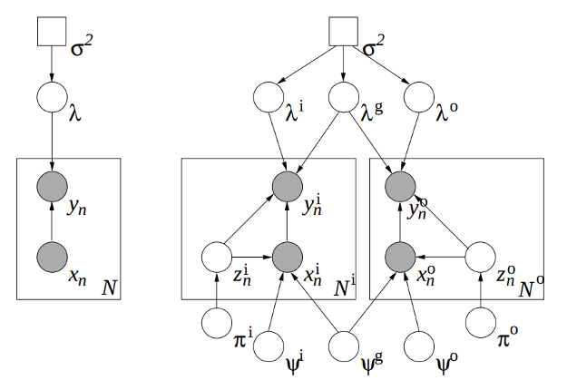

Daume III, Hal, and Daniel Marcu. "Domain adaptation for statistical classifiers." Journal of Artificial Intelligence Research 26 (2006): 101-126.

## Summary

Techniques used before this paper included:

1. treat out-of-domain data as *prior knowledge* by performing a MAP
estimate using this prior distribution
2. use out-of-domain data to estimate a prior distribution in the
context of a maximum entropy model, and this becomes the mean weights
for a Gaussian prior for the in-domain data
3. build an out-of-domain model and use its predictions as features
for the in-domain data

This paper considers three distributions, $q^{(o)}$, $q^{(g)}$ and
$q^{(i)}$, where the out-of-domain distribution $p^{(o)}$ is a mixture
of a domain-specific and general distribution, $q^{(o)}$ and
$q^{(g)}$. Likewise, the in-domain distribution $p^{(i)}$ is a mixture
of $q^{(i)}$ and $q^{(g)}$.

They apply it to log-linear conditional maximum entropy models and
their linear chain counterparts.

### Review of Maximum Entropy Models

The maximum entropy framework seeks the conditional distribution $p(y
| x)$ that is closest to the uniform distribution while matching a set
of training data $\mathcal{D}$ with respect to feature function
expectations. That is, it seeks for the minimizer of $\mathrm{KL}\big(
p(y|x)\ \big|\big|\ \mathrm{uniform}(y)\big)$.

Introducing a Lagrange multiplier for each feature function $f_i$
yields a probability distribution function of the form:
$$\begin{equation}\label{class}
p(y | x; \lambda) = \frac{1}{Z_{\lambda,x}}
\mathrm{exp}\left[\lambda^\top \mathbf{f}(x,y)\right],
\end{equation}$$
called an *exponential distribution* or a *Gibbs
distribution*. A regularization term is often included to prevent
overfitting by placing a Gaussian prior over $\lambda$ with mean 0 and
covariance $\sigma^2I$. Furthermore, we may assume that we can
identify $x$ with a binary feature vector, and so instead of
$\lambda^\top mathbf{f}(x,y)$, we can consider $\lambda_y^\top x$. And
so, the log-likelihood becomes: 
$$\mathcal{L} = - \frac{1}{2\sigma^2} \lambda^\top \lambda +
\sum_{i=1}^N \left[\lambda_{y_i}^\top x_n - \log \sum_{y' \in
\mathcal{Y}} \mathrm{exp}\left[\lambda_{y'}^\top x_n\right]\right] + C.
$$

### Maximum Entropy Genre Adaptation Model

This paper then extends the maximum entropy model to the *maximum
entropy genre adaptation* (MEGA) model. This model assumes that each
in-domain data point $(x^{(i)},y^{(i)})$ has a corresponding latent
binary indicator $z$ that is equal to 1 when the data point is drawn
from $q^{(i)}$ and 0 when drawn from $q^{(g)}$ (likewise for
out-of-domain data). The $z$'s are drawn from a Bernoulli distribution
with parameter $\pi^{(i)}$. And correspondingly, there are
$\lambda^{(i)}$, $\lambda^{(g)}$ and $\lambda^{(o)}$ for the three
distributions $q^{(i)}$, $q^{(g)}$ and $q^{(o)}$.

Finally, the model also assumes that the data $x^{(i)}$ are drawn from
Bernoulli distributions parametrized either by $\psi^{(i)}$ or
$\psi^{(g)}$ (and likewise for $x^{(o)}$). The $\psi$'s are given a
Beta prior. Thus, the generative story for an in-domain data point
$x^{(i)}$ is:

1. select whether $x^{(i)}$ will be in-domain or general-domain,
indicated by $z^{(i)}$, where $z^{(i)} \sim \mathrm{Ber}(\pi^{(i)})$.
2. For each component $f$ of $x^{(i)}$, choose $x_f^{(i)}$ according
to the distribution $\mathrm{Ber}(\psi_f^{z^{(i)}})$.
3. Choose $y$ according to Equation $\ref{class}$ using the parameter
$\lambda^{z^{(i)}}$.

**Figure 1.** (Left) standard logistic regression model (right) MEGA model.

Source: <a
href="https://arxiv.org/pdf/1109.6341.pdf">Daume Marcu 2006</a>

   

### Linear Chain Model

The *maximum entropy Markov model* (MEMM) is obtained by assuming that
the targest $y_n$ are a sequence of labels. For example, parts of
speech tagging may be achieved by introducing a first-order Markov
assumption on the tag sequence (as a discriminative counterpart to the
standard generative HMM).

### Conditional Expectation Maximization

A nice summary comparing EM vs. CEM:

>At a high level, EM is useful for computing in *generative* models
>with hidden variables, while conditional expectation maximization
>(CEM) is useful for computing in *discriminative* models with hidden
>variables. 
>
(Daume Marcu 2006).

The standard EM maximizes a joint likelihood over data. However,
conditional models need to maximize the conditional likelihood:
$$\begin{align}
\mathcal{L} &= \log p(y|x;\theta) \nonumber \\
&= \log \sum_z p(z,x,y| \theta) - \log \sum_z p(z,x | \theta),
\end{align}$$
where we can't apply Jensen's to the second term (as we would to the
first in the standard EM algorithm)  to get a lower bound on the
likelihood. 

The CEM solution (Jebara Pentland 1998) is to bound the *change* in
conditional log likelihood between iterations:
$$\Delta \mathcal{L}^c = \log p(y | x; \theta^t) - \log
p(y|x;\theta^{t-1}).$$ 
Combine this with the (tight) upper bound, $\log x \leq x - 1$ leads
to the lower bound on the change in log likelihood:
$$\Delta \mathcal{L}^c \geq Q^t:= \sum_{z \in \mathcal{Z}} h_z \log
\frac{p(z,x,y|\theta^t)}{p(z,x,y|\theta^{t-1})} - \frac{\sum_z p(z,x |
\theta^t)}{\sum_z p(z,x|\theta^{t-1})} + 1,$$
where $h_z = p(z | x; \theta)$.

The corresponding MAP estimate just adds a $\log p(\theta)$ to $Q^t$.

### MEGA CEM

See section 5 of paper for derivation of CEM for the MEGA model and
complete training algorithm. 

## Discussion

**Question 1.** Here, related knowledge is modeled by a general domain
  distribution $q^{(g)}$ mixed with a domain-specific
  distribution. What non-distributional approaches to domain
  adaptation/transfer learning are there? Learning analogies?

### Further Reading

- [[Jebara Pentland 1998](http://papers.nips.cc/paper/1537-maximum-conditional-likelihood-via-bound-maximization-and-the-cem-algorithm.pdf)] Maximum Conditional Likelihood via Bound Maximization and the CEM Algorithm 