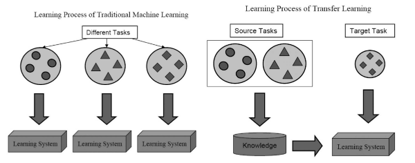
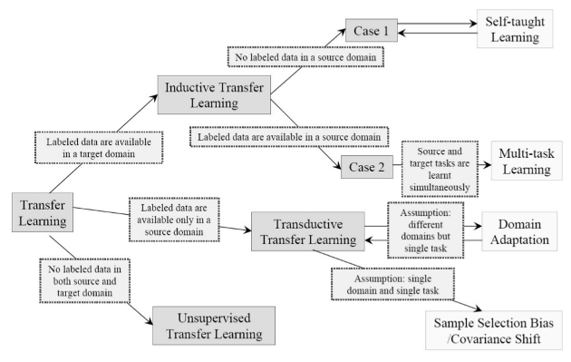
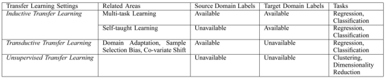

Pan, Sinno Jialin, and Qiang Yang. "A survey on transfer learning." IEEE Transactions on knowledge and data engineering 22.10 (2010): 1345-1359.

## Summary

As an example, a place where tranfer learning is needed is when data
becomes outdated.

### History

Since 1995, transfer learning has been called learning to learn,
life-long learning, knowledge transfer, inductive transfer, multitask
learning, knowledge consolidation, context-sensitive learning,
knowledge-based inductive bias, metalearning, and
incremental/cumulative learning. In multitask learning, one common
method is the attempt to uncover latent variables shared among
individual tasks.

Later on, transfer learning tends to specify a *source task* and a
*target task*, where knowledge learned from the former is applied to
the latter.

**Figure 1.** Traditional vs. transfer machine learning.

Source: <a
href="https://ieeexplore.ieee.org/stamp/stamp.jsp?arnumber=5288526">Pan,
Yang 2010</a>

   

### Setting

A *domain* $\mathcal{D} = (\mathcal{X},P(X))$$ is a feature space
$\mathcal{X}$ with a marginal probability distribution $P(X)$, where
$X = \{x_1,\dotsc, x_n\} \subset \mathcal{X}$ is a particular learning
sample.  

Given a domain, a *task* $\mathcal{T} = \{\mathcal{Y}, f\}$ consists
of a label space $\mathcal{Y}$ and an objective predictive function
$f$. Though we don't observe $f$, we can observe labeled samples
$\{x_i, y_i\}$. We let $\mathcal{D}_S$ be the source domain and
$\mathcal{D}_T$ be the target domain.

**Definition 1 (Transfer learning).** Given a source domain
  $\mathcal{D}_S$ and a learning task $\mathcal{T}_S$, a target domain
  $\mathcal{D}_T$ and learning task $\mathcal{T}_T$, *transfer
  learning* aims to help improve the learning of the target predictive
  function $f_T$ using knowledge in $\mathcal{D}_S$ and
  $\mathcal{T}_S$, where $\mathcal{D}_S \ne \mathcal{D}_T$, or
  $\mathcal{T}_S \ne \mathcal{T}_T$.

For example, a transfer learning setting is document classification,
where $\mathcal{D}_S$ and $\mathcal{D}_T$ correspond to different
languages ($\mathcal{X}_S \ne \mathcal{X}_T$), or the target and
source are focused on different topics ($P(X_S)\ne P(X_T)$).

Research issues in transfer learning are focused on:

- what to transfer
- how to transfer 
- when to transfer (e.g. how to avoid *negative transfer*)

And depending on the learning situation, there are three subsettings:

- inductive transfer learning
- transductive transfer learning
- unsupervised transfer learning

**Figure 2.** Subsettings in transfer learning. [[large](../files/pan-yang-transfer-overview.png)]

Source: <a
href="https://ieeexplore.ieee.org/stamp/stamp.jsp?arnumber=5288526">Pan,
Yang 2010</a>

 

**Figure 3.** Overview of settings in transfer learning. [[large](../files/pan-yang-transfer-settings.png)]

Source: <a
href="https://ieeexplore.ieee.org/stamp/stamp.jsp?arnumber=5288526">Pan,
Yang 2010</a>

  

The methods of transfer learning are generally classified into:

- instance transfer: reweight labeled data in source domain for use in
  target domain (instance reweighting, importance sampling)
- feature-representation transfer: find a 'good' feature
  representation that reduces differences between source and target
  domains and the error of classification/regression models
- parameter transfer: discover shared parameters or priors between
  source domain and target domain
- relational-knowledge transfer: build mapping of relational
  knowledge between source domain and the target domain. Both domains
  are relational domains and i.i.d. assumption is relaxed (Mihalkova
  Huynh Mooney 2007). 

Note that unsupervised transfer learning only makes use of
feature-representation transfer. Transuctive transfer learning can
also make use of instance-transfer. Inductive transfer learning can
use all four methods.

### Inductive Transfer Learning

In the inductive transfer learning setting, the target task differs
from the source task. When a lot of labeled data are available in the
source task, then this setting is similar to multitask learning
(though here, we only care about the target task). When there is no
labeled data in the source task, then this is similar to *self-taught
learning*. 

**Definition 2 (Inductive Transfer Learning).** Given source domain
  and task $\mathcal{D}_S, \mathcal{T}_S$ and target domain and task
  $\mathcal{D}_T, \mathcal{T}_T$, *inductive transfer learning* aims
  to improve the learning of the target predictive function $f_T$
  using the knowledge in $\mathcal{D}_S$ and $\mathcal{T}_S$ where
  $\mathcal{T}_S \ne \mathcal{T}_T$.

Thus, labeled training data *induce* the target predictive
function. 

**Instance Transfer Approach.** One method is the *TrAdaBoost*
  algorithm (Dai Yang Xue Yu 2007), which assumes that the source and
  target domain share the same features and labels, but with different
  distributions. Due to the difference in distribution, some source
  data may be helpful, while other may be harmful. The method
  iteratively reweights source data to reduce "bad" effects while
  encouraging "good" effects. 

  Another is an active learning method that selects unlabeled data in
  the target domain to be labeled with the help of source domain data
  (Liao Xue Carin 2005).

  One compares conditional probabilities $P(y_T|x_T)$ and $P(y_S|x_S)$
  to remove "misleading" training examples (Jiang Zhai 2007).

**Feature Representation Transfer.** In the supervised setting, the
  goal is to learn a low-dimensional representation shared across
  related tasks. For example, (Argyriou Evegniou Pontil 2007) proposed
  a sparse feature learning method, by solving the optimization
  problem: 
  $$\begin{align*}
  \mathrm{arg\ min}_{A,U}& \quad \sum_{t \in \{T,S\}} \sum_{i=1}^{n_t}
  L(y_{t_i}, \langle a_t, U^\top x_{t_i}\rangle) + \gamma
  ||A||^2_{2,1}\\
  \mathrm{s.t.} & \quad U \in O(d).
  \end{align*}$$
  where $||A ||_{r,p} := \left(\sum_{i=1}^d
  ||a^i||_r^p\right)^{1/p}$ is the $(r,p)$-norm of $A$, and $O(d)$ is
  the collection of $d \times d$ unitary matrices. This is just a
  regularized empirical loss over both source and target tasks. This
  was followed up by (Argyriou Micchelli Pontil Ying 2008) a spectral
  method. See also (Lee Chatalbashev Vickrey Koller 2007). For kernel
  selection, see (Jebara 2004) and (Rücker Kramer 2008). 

  See paper for the unsupervised setting, with methods using sparse
  coding (Raina 2007) and manifold learning  (Wang Mahadevan 2008),
  e.g. to align manifolds and transfer knowledge via aligned
  manifold. 

**Parameter Transfer.** One method proposes a Gaussian Process (GP)
  prior that is shared across multiple tasks. Covariance matrix over
  tasks can model intertask dependences (Lwarence Platt 2004).

  Another method assumes that the parameter $w$ in SVMs for each task
  can be separated into two terms: a common term and a task-specific
  term, so that:
  $$\begin{equation*}
  w_S = w_0 + v_S \quad\quad w_T = w_0 + v_T.
  \end{equation*}$$

**Relational Knowledge Transfer.** This method using *statistical
  relational learning techniques* deals with relational domains (such
  as networked data). See (Mihalkova Huynh Mooney 2007) for the
  algorithm TAMAR, relying on Markov Logic Networks (MLNs). See
  (Richardson Domingos 2005) on MLNs, combining first-order logic with
  probability. Further extensions in (Mihalkova Mooney 2008) and
  (Davis Domingos 2009). 

### Transductive Transfer Learning

The source and target are the same, but the domains are different. In
particular, the feature space may differ, or the marginal
distributions may differ. In the latter case, this is related to
domain adaptation for knowledge transfer in text classification (Daume
Marcu 2006), sample selection bias (Zadrozny 2004), and covariate
shift (Shimodaira 2000).

**Definition 3 (Transductive Transfer Learning.** Given a source
  domain and task $\mathcal{D}_S$ and $\mathcal{T}_T$, a target domain
  and task $\mathcal{D}_T$ and $\mathcal{T}_T$, *transductive transfer
  learning* aims to learn the target predictive function using the
  knowledge $\mathcal{D}_S$ and $\mathcal{T}_S$ where $\mathcal{D}_S
  \ne \mathcal{D}_T$ and $\mathcal{T}_S = \mathcal{T}_T$. In addition,
  some unlabeled target-domain data must be available at training
  time.

**Instance Transfer.** When $P(D_S) \ne P(D_T)$, then we need to
modify the usual optimization problem:
$$\begin{equation}
\theta^* = \mathrm{arg\ min}_{\theta \in \Theta} \sum_{(x,y) \in D_T}
P(D_T) \ell(x,y,\theta) \tag{usual problem}
\end{equation}$$
with the problem:
$$\begin{align}
\theta^* &= \mathrm{arg\ min}_{\theta\in\Theta} \sum_{(x,y) \in D_S}
\frac{P(D_T)}{P(D_S)} P(D_S) \ell(x,y,\theta) \tag{modified problem}\\
&\approx \mathrm{arg\ min}_{\theta \in \Theta} \sum_{i=1}^{n_S}
\frac{P_T(x_{T_i}, y_{T_i})}{P(x_{S_i}, y_{S_i})}
\ell(x_{S_i},y_{S_i}, \theta)\nonumber
\end{align}$$
There are a few ways to estimate $P(x_S)/P(x_T)$. See (Zadrozny 2004)
and (Huang Smola Gretton Borgwardt Scholkopf 2007) for kernel-mean
matching (KMM). For the Kullback-Leibler Importance Estimation
Procedure (KLIEP), see (Sugiyama et. al. 2008).

**Feature Representation Transfer.** The *structural correponsdence
  learning* (SCL) algorithm defines a set of *pivot* features
  (relevant features that may reduce difference between domains,
  depending on domain and prior knowledge). SCL removes pivot features
  from the data and treats these as label vectors. Choosing the pivot
  features is difficult; one method uses mutual information (MI-SCL)
  to find pivot features that have high dependence on the labels in
  source domain.

  In NLP, transfer learning is also called *domain adaptation* (Daume
  2007). 

### Unsupervised Transfer Learning

In unsupervised transfer learning, the task is different, such as
clustering (Dai Yang Xue Yu 2008), dimensionality reduction (Wang Song
Zhang 2008), and density estimation.

**Definition 4 (Unsupervised Transfer Learning).** Given source domain
  and task $\mathcal{D}_S$ and $\mathcal{T}_S$ and target domain and
  task $\mathcal{D}_T$ and $\mathcal{T}_T$, *unsupervised transfer
  learning* aims to learn the target predictive function $f_T$ using
  knowledge in $\mathcal{D}_S$ and $\mathcal{T}_S$ where
  $\mathcal{T}_S \ne \mathcal{T}_T$ and $\mathcal{Y}_S$ and
  $\mathcal{Y}_T$ are not observable.

**Feature Representation Transfer.** *Self-taught clustering* is an
  example of unsupervised transfer learning, trying to learn a common
  feature space across domains. Similarly, there is also a transfer
  dimensionality reduction (TDA) problem.

### Transfer Bounds and Negative Transfer

Theoretical bounds are proved using Kolmogorov complexity in (Mahmud
Ray 2008).

Little work shows how to avoid negative transfer, when reduce
performance occurs due to transfer of knowledge. It is shown
empirically that if the tasks are too dissimilar, then negative
transfer may occur. 

## Discussion

**Question 1.** What sort of target tasks become really easy to learn
  once you've learned a source task? Tensor decomposition seems like
  an example, where it's hard to learn a latent variable model. But
  constructing data for higher order interaction leads to a different
  problem that's easier. Then, the solution to that problem also gives
  a solution to the target task.

### Further Reading

- [[Caruana 1997](https://link.springer.com/content/pdf/10.1023/A:1007379606734.pdf)] Multitask Learning
- [[Raina 2007](http://ai.stanford.edu/~hllee/icml07-selftaughtlearning.pdf)] Self-Taught Learning: Transfer Learning from Unlabeled Data
- [[Daume Marcu 2006](https://arxiv.org/pdf/1109.6341.pdf)] Domain Adaptation for Statistical Classifiers
- [[Zadrozny 2004](http://citeseerx.ist.psu.edu/viewdoc/download?doi=10.1.1.92.170&rep=rep1&type=pdf)] Learning and evaluating classifiers under sample selection bias
- [[Shimodaira 2000](http://citeseerx.ist.psu.edu/viewdoc/download?doi=10.1.1.370.4921&rep=rep1&type=pdf)] Improving predictive inference under covariate shift by weighting the log-likelihood function
- [[Dai Yang Xue Yu 2008](https://www.cse.ust.hk/~qyang/Docs/2008/dwyakicml.pdf)] Self-Taught Clustering
- [[Wang Song Zhang 2008](https://link.springer.com/content/pdf/10.1007%2F978-3-540-87481-2_36.pdf)] Transferred Dimensionality Reduction
- [[Mihalkova Huynh Mooney 2007](http://www.cs.utexas.edu/~ai-lab/pubs/mihalkova-aaai07.pdf)] Mapping and Revising Markov Logic Networks for Transfer Learning
- [[Dai Yang Xue Yu 2007](http://citeseerx.ist.psu.edu/viewdoc/download?doi=10.1.1.646.8484&rep=rep1&type=pdf)] Boosting for Transfer Learning
- [[Liao Xue Carin 2005](http://people.ee.duke.edu/~xjliao/paper/ICML05_MigLogit.pdf)] Logistic Regression with an Auxiliary Data Source
- [[Jiang Zhai 2007](http://sifaka.cs.uiuc.edu/czhai/pub/acl07.pdf)] Instance Weighting for Domain Adaptation in NLP
- [[Argyriou Evgeniou Pontil 2007](https://papers.nips.cc/paper/3143-multi-task-feature-learning.pdf)] Multi-Task Feature Learning
- [[Agryriou Micchelli Pontil Ying 2008](http://www0.cs.ucl.ac.uk/staff/M.Pontil/reading/spectral_mtl.pdf)] A Spectral Regularization Framework for Multi-Task Structure Learning
- [[Agryriou Michelli Potnil 2010](http://www.jmlr.org/papers/volume11/argyriou10a/argyriou10a.pdf)] On Spectral Learning
- [[Signoretto Dinh Lathauwer Suykens 2014](https://link.springer.com/content/pdf/10.1007%2Fs10994-013-5366-3.pdf)] Learning with tensors: a framework based on convex optimization and spectral regularization
- [[Lee Chatalbashev Vickrey Koller 2007](https://ai.stanford.edu/~koller/Papers/Lee+al:ICML07.pdf)] Learning a Meta-Level Prior for Feature Relevance from Multiple Related Tasks
- [[Jebara 2004](http://www.cs.columbia.edu/~jebara/papers/metalearn.pdf)] Multi-Task Feature and Kernel Selection for SVMs
- [[Rücker Kramer 2008](http://citeseerx.ist.psu.edu/viewdoc/download?doi=10.1.1.164.343&rep=rep1&type=pdf)] Kernel-Based Inductive Transfer
- [[Lawrence Platt 2004](http://citeseerx.ist.psu.edu/viewdoc/download?doi=10.1.1.440.3620&rep=rep1&type=pdf)] Learning to Learn with the Informative Vector Machine
- [[Richardson Domingos 2005](https://homes.cs.washington.edu/~pedrod/papers/mlj05.pdf)] Markov Logic Networks
- [[Davis Domingos 2009](http://pages.cs.wisc.edu/~jdavis/davisICML09.pdf)] Deep Transfer via Second-Order Markov Logic
- [[Mihalkova Mooney 2008](http://www.cs.utexas.edu/~ml/papers/lily-ws-aaai-08.pdf)] Transfer Learning by Mapping with Minimal Target Data
- [[Huang Smola Gretton Borgwardt Scholkopf 2007](https://papers.nips.cc/paper/3075-correcting-sample-selection-bias-by-unlabeled-data.pdf)] Correcting Sample Selection Bias by Unlabeled Data
- [[Sugiyama et. al. 2008](https://papers.nips.cc/paper/3248-direct-importance-estimation-with-model-selection-and-its-application-to-covariate-shift-adaptation.pdf)] Direct Importance Estimation with Model Selection and its Application to Covariate Shift Adaptation
- [[Daume III 2007](http://users.umiacs.umd.edu/~hal/docs/daume07easyadapt.pdf)] Frustratingly easy domain adaptation
- [[Mahmud Ray 2008](https://papers.nips.cc/paper/3228-transfer-learning-using-kolmogorov-complexity-basic-theory-and-empirical-evaluations.pdf)] Transfer Learning Using Kolmogorov Complexity: Basic Theory and Empirical Evaluations